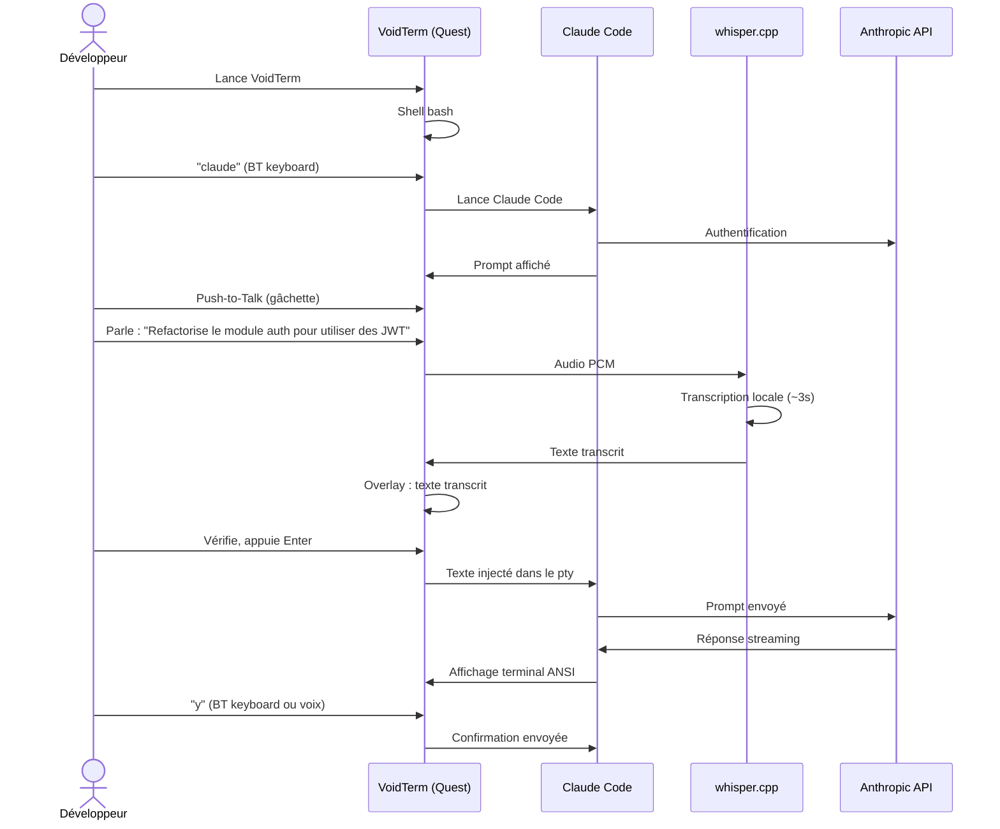
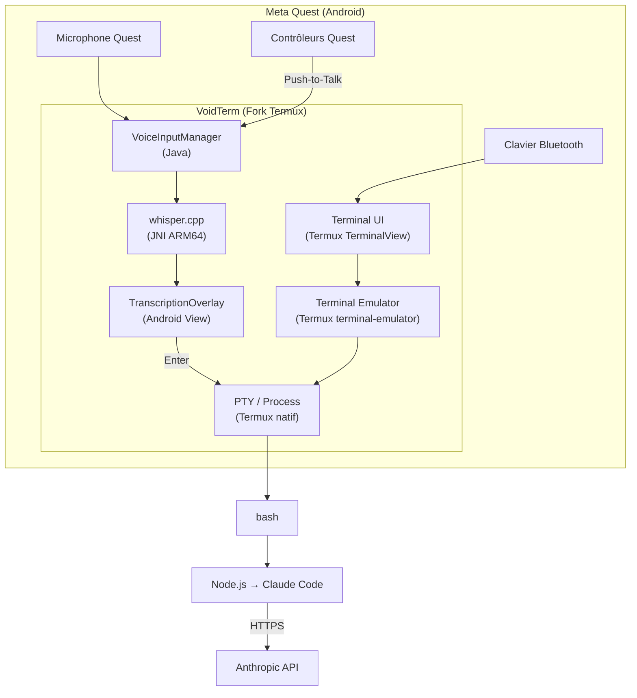
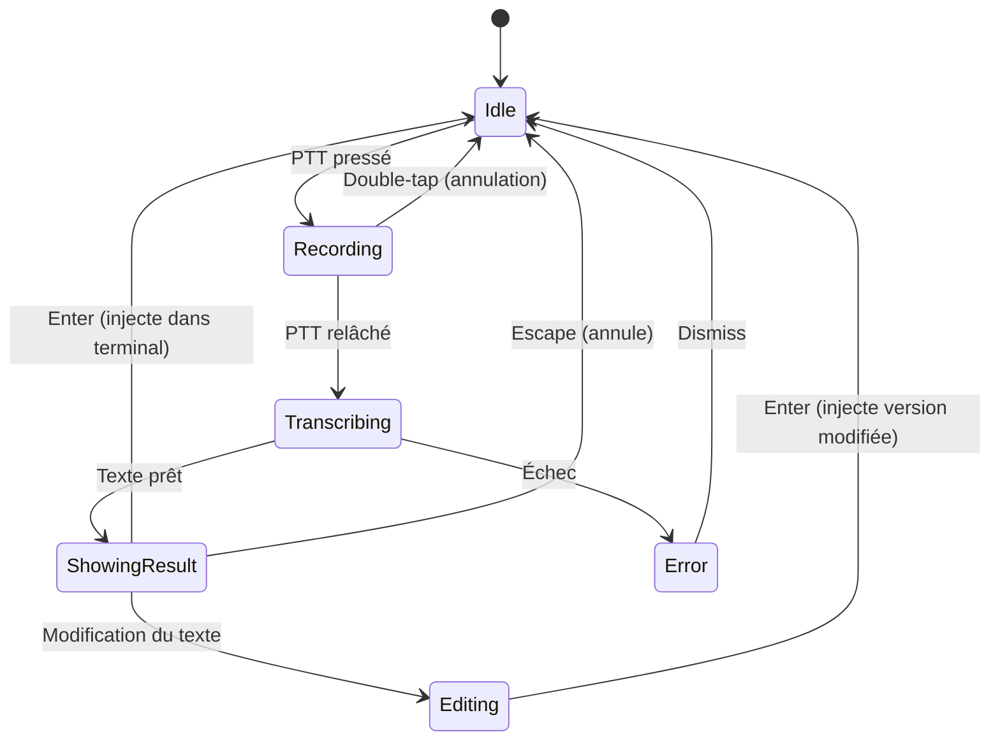
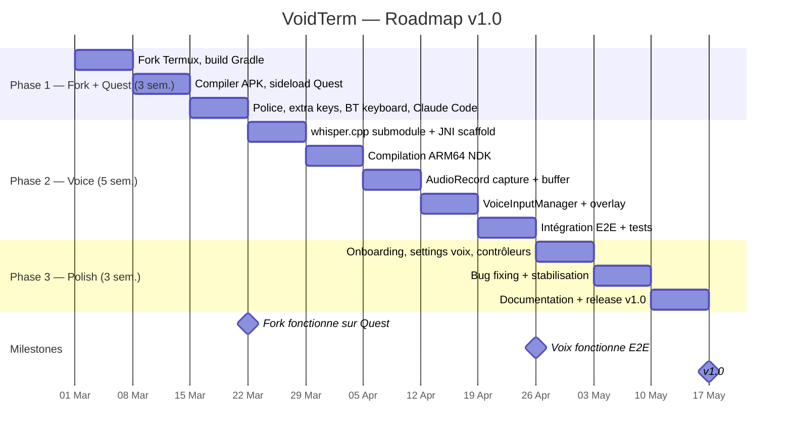

# VoidTerm — Cahier des Charges Technique

**Version :** 1.0  
**Date :** 21 février 2026  
**Licence :** GPL-3.0  

---

## 1. Présentation du projet

### 1.1 Définition

VoidTerm est un fork de Termux avec saisie vocale intégrée via whisper.cpp, conçu pour le Meta Quest. L'application s'affiche en tant que panneau 2D dans l'environnement Quest. Elle permet d'exécuter Claude Code (Anthropic) localement dans l'environnement Linux de Termux, avec la possibilité de dicter les prompts par la voix.

### 1.2 Paramètres

| Paramètre | Valeur |
|---|---|
| Type | Application Android native (fork Termux) |
| Plateforme cible | Meta Quest 2 / 3 / Pro |
| Affichage | Panneau 2D flat (pas de VR spatial) |
| Base de code | Termux (GPL-3.0) |
| Ajout principal | whisper.cpp (STT local, MIT) |
| Cas d'usage principal | Claude Code local via Termux |
| Distribution | Sideload APK, GitHub Releases |
| Équipe | Solo développeur (phase initiale) |
| Horizon | 11 semaines pour la v1.0 |

### 1.3 Périmètre

**Inclus :**
- Terminal Termux complet (shell, package manager, filesystem)
- Saisie vocale Push-to-Talk avec transcription locale
- Optimisations d'affichage pour Quest (taille police, extra keys)
- Support clavier Bluetooth natif
- Assistant de premier lancement

**Exclus :**
- Interface VR 3D / fenêtres spatiales
- Client SSH dédié (Termux l'inclut déjà)
- Serveur STT distant
- Modèles Whisper medium / large
- Support iOS
- Publication Google Play ou Meta Quest Store

---

## 2. Spécifications fonctionnelles

### 2.1 Priorisation

#### MUST HAVE (v1.0)

| # | Fonctionnalité |
|---|---|
| M1 | Terminal Termux fonctionnel sur Quest (fork compilé, sideloadable) |
| M2 | whisper.cpp intégré via JNI, modèle `base` embarqué |
| M3 | Push-to-Talk (bouton contrôleur ou touche extra keys) |
| M4 | Overlay de transcription (texte affiché avant injection, éditable) |
| M5 | Injection dans le terminal après validation explicite (Enter) |
| M6 | Police monospace 20sp par défaut, configurable |
| M7 | Extra keys agrandies pour le raycast contrôleur Quest |
| M8 | Support clavier Bluetooth vérifié sans régression |
| M9 | Claude Code installable et fonctionnel (`pkg install nodejs`, `npm i -g @anthropic-ai/claude-code`) |

#### SHOULD HAVE (v1.1)

| # | Fonctionnalité |
|---|---|
| S1 | Assistant de premier lancement (installation Node.js, Claude Code, test micro) |
| S2 | Choix du modèle Whisper dans les paramètres (tiny / base) |
| S3 | Choix de la langue STT (EN, FR) |
| S4 | Raccourci Push-to-Talk configurable |
| S5 | Taille de police configurable via slider |
| S6 | Indicateur d'état voix (idle / recording / transcribing) |

#### COULD HAVE (v1.2+)

| # | Fonctionnalité |
|---|---|
| C1 | Commandes vocales ("new session", "scroll up", "clear") |
| C2 | Historique des transcriptions (revoir / ré-injecter) |
| C3 | Thèmes de couleur optimisés Quest |
| C4 | Auto-scroll intelligent avec indicateur "New output" |
| C5 | Profils de commande au démarrage (lancer Claude Code automatiquement) |

### 2.2 User Stories

**US-01 — Utiliser Claude Code sur Quest**  
*En tant que* développeur,  
*je veux* lancer VoidTerm sur mon Quest et utiliser Claude Code directement,  
*afin de* coder sans PC ni écran externe.

*Critères d'acceptation :*
- L'app se lance comme panneau 2D sur Quest
- Le shell bash est disponible
- `pkg install nodejs` puis `npm i -g @anthropic-ai/claude-code` fonctionne
- `claude` se lance et affiche correctement le prompt (couleurs ANSI incluses)
- Les réponses streaming s'affichent sans corruption
- Le scroll dans l'historique fonctionne

**US-02 — Dicter un prompt par la voix**  
*En tant que* développeur en VR,  
*je veux* dicter un prompt au lieu de le taper,  
*afin de* formuler des instructions longues sans clavier.

*Critères d'acceptation :*
- Appui sur Push-to-Talk → indicateur visuel d'enregistrement
- Relâchement → indicateur "Transcription en cours"
- Texte transcrit affiché dans un overlay au-dessus du terminal
- L'utilisateur peut relire, modifier (BT keyboard), valider (Enter) ou annuler (Escape)
- Le texte n'est jamais exécuté automatiquement
- Latence transcription ≤ 5s pour 10s d'audio sur Quest 3

**US-03 — Utiliser un clavier Bluetooth**  
*En tant que* développeur avec un clavier BT appairé au Quest,  
*je veux* taper normalement dans le terminal,  
*afin d'*utiliser des commandes shell et naviguer efficacement.

*Critères d'acceptation :*
- Toutes les touches fonctionnent (lettres, chiffres, symboles, Enter, Tab, Escape, flèches)
- Ctrl+C, Ctrl+D, Ctrl+Z fonctionnent
- Voix et clavier coexistent sans conflit

**US-04 — Premier lancement**  
*En tant que* nouvel utilisateur,  
*je veux* être guidé pour installer Claude Code,  
*afin de* démarrer rapidement.

*Critères d'acceptation :*
- Dialogue de bienvenue au premier lancement
- Installation automatisée proposée : `pkg update && pkg install nodejs git`
- Commande Claude Code affichée, copiable
- Test micro disponible
- Tout est skippable

### 2.3 Flux principal



---

## 3. Architecture technique

### 3.1 Vue d'ensemble



### 3.2 Composants

| Composant | Source | Modification |
|---|---|---|
| TerminalView | Termux (terminal-view) | Taille police par défaut augmentée |
| TerminalEmulator | Termux (terminal-emulator) | Aucune |
| TermuxActivity | Termux (termux-app) | Ajout bouton PTT, overlay voix, onboarding |
| TermuxTerminalSessionClient | Termux | Hook pour injection de texte vocal |
| Package manager (apt) | Termux | Aucune |
| Bootstrap filesystem | Termux | Aucune |
| Extra keys row | Termux | Ajout touche 🎤, taille boutons augmentée |
| **VoiceInputManager** | **Nouveau** | Capture audio, machine d'état PTT |
| **WhisperJNI** | **Nouveau** | Bridge JNI vers whisper.cpp |
| **TranscriptionOverlay** | **Nouveau** | UI affichage/édition transcription |
| **OnboardingFlow** | **Nouveau** | Assistant premier lancement |
| **QuestInputHandler** | **Nouveau** | Mapping contrôleurs Quest → actions |

### 3.3 Structure du projet

```
voidterm/
├── app/
│   └── src/main/
│       ├── java/com/voidterm/
│       │   ├── app/
│       │   │   ├── TermuxActivity.java         # Modifié
│       │   │   └── ...                         # Termux existant
│       │   └── voice/                          # Nouveau package
│       │       ├── VoiceInputManager.java
│       │       ├── AudioCapture.java
│       │       ├── WhisperJNI.java
│       │       └── TranscriptionOverlay.java
│       ├── res/
│       │   ├── layout/
│       │   │   ├── transcription_overlay.xml   # Nouveau
│       │   │   └── onboarding_dialog.xml       # Nouveau
│       │   └── values/
│       │       └── quest_defaults.xml          # Nouveau
│       └── jni/
│           ├── whisper_jni.cpp                 # Nouveau
│           ├── CMakeLists.txt
│           └── whisper.cpp/                    # Submodule git
├── terminal-emulator/                          # Inchangé
├── terminal-view/                              # Changements mineurs
├── termux-shared/                              # Inchangé
├── assets/models/
│   ├── ggml-base.bin                           # 142 Mo
│   └── ggml-tiny.bin                           # 75 Mo
├── docs/
│   ├── BUILDING.md
│   ├── QUEST_SETUP.md
│   └── CLAUDE_CODE_SETUP.md
└── build.gradle
```

### 3.4 Dépendances

| Dépendance | Licence | Usage |
|---|---|---|
| Termux app | GPL-3.0 | Base du projet |
| terminal-emulator | Apache-2.0 | Émulation terminal |
| terminal-view | Apache-2.0 | Rendu terminal Android |
| whisper.cpp | MIT | STT local |
| ggml | MIT | Inférence ML (inclus dans whisper.cpp) |

Aucune dépendance externe supplémentaire. Le build produit un seul APK.

### 3.5 Threading

| Thread | Rôle | Notes |
|---|---|---|
| **Main** | UI, rendu terminal, overlay | Jamais bloqué |
| **Terminal** | Lecture/écriture PTY | Géré par Termux existant |
| **Audio** | Capture AudioRecord pendant PTT | Actif uniquement pendant l'enregistrement |
| **Whisper** | Inférence whisper.cpp native | Burst CPU 2-4s, résultat via `runOnUiThread()` |

---

## 4. Intégration whisper.cpp

### 4.1 Interface JNI

**Fichier : `whisper_jni.cpp`**

| Méthode | Signature | Description |
|---|---|---|
| `nativeInit` | `(String modelPath) → long` | Charge le modèle, retourne un handle |
| `nativeTranscribe` | `(long ctx, float[] audio, String lang) → String` | Transcrit PCM → texte |
| `nativeFree` | `(long ctx) → void` | Libère le modèle |
| `nativeIsLoaded` | `(long ctx) → boolean` | Vérifie l'état |

### 4.2 Paramètres audio

| Paramètre | Valeur |
|---|---|
| Format | float32 PCM |
| Sample rate | 16 000 Hz |
| Canaux | Mono |
| Durée max | 30 secondes |
| Source Android | `MediaRecorder.AudioSource.MIC` |
| Encoding Android | `AudioFormat.ENCODING_PCM_FLOAT` |

### 4.3 Modèles Whisper embarqués

| Modèle | Taille fichier | RAM estimée | Latence Quest 3 (10s audio) | Usage |
|---|---|---|---|---|
| **base** (défaut) | 142 Mo | ~300 Mo | 2-4s | Qualité standard EN/FR |
| tiny (option) | 75 Mo | ~200 Mo | 1-2s | Fallback léger, Quest 2 |

Le modèle est copié de `assets/` vers le stockage interne au premier lancement. Le chargement en mémoire (`nativeInit`) est effectué au démarrage de l'app (~2-3s).

### 4.4 Taille de l'APK

| Composant | Taille |
|---|---|
| Termux base | ~15 Mo |
| whisper.cpp ARM64 | ~5 Mo |
| Modèle base | ~142 Mo |
| Modèle tiny | ~75 Mo |
| **Total** | **~240 Mo** |

Option : télécharger les modèles au premier lancement pour réduire la taille de l'APK initial.

### 4.5 VoiceInputManager — Machine d'état



### 4.6 TranscriptionOverlay

`FrameLayout` semi-transparent affiché au-dessus du terminal.

**États visuels :**

| État | Contenu affiché |
|---|---|
| Recording | Icône 🎤 + barre de volume + "Recording..." |
| Transcribing | Icône ⏳ + "Transcribing..." |
| ShowingResult | Zone texte avec transcription + bouton ✓ Send + bouton ✕ Cancel |
| Editing | Zone texte éditable (curseur actif) + ✓ Send + ✕ Cancel |

---

## 5. Adaptations Quest

### 5.1 Affichage

| Paramètre | Valeur par défaut | Configurable |
|---|---|---|
| Taille police terminal | 20sp | Oui (slider) |
| Police | Monospace (Termux default) | Non (v1.0) |
| Taille extra keys | 150% de la taille Termux standard | Non (v1.0) |
| Bouton 🎤 dans extra keys | Oui | Non |

### 5.2 Contrôleurs Quest

| Action | Input | Implémentation |
|---|---|---|
| Pointeur / clic | Trigger (index) | Natif Android |
| Push-to-Talk | Bouton A ou X (configurable) | `onKeyDown()` / `onKeyUp()` |
| Scroll terminal | Thumbstick up/down | Natif Android |
| Back | Bouton B ou Y | Natif Android |

Les keycodes des boutons Quest seront identifiés par test au runtime et rendus configurables dans les paramètres.

### 5.3 Phantom Process Killing (Android 12+)

Android 12+ tue les processus enfants au-delà de 32 processus (toutes apps confondues). Claude Code + Node.js + bash crée 5-10 processus.

**Fix requise (une seule fois, via ADB) :**

```
adb shell "/system/bin/device_config set_sync_disabled_for_tests persistent"
adb shell "/system/bin/device_config put activity_manager max_phantom_processes 2147483647"
adb shell settings put global settings_enable_monitor_phantom_procs false
```

Documentée dans `QUEST_SETUP.md` et proposée dans l'assistant de premier lancement.

---

## 6. Sécurité

### 6.1 Surface d'attaque

| Vecteur | Sévérité | Mitigation |
|---|---|---|
| API key Anthropic en variable d'env | Moyenne | Mode standard de Claude Code. Stockée dans le répertoire privé de l'app Android. Documenter les bonnes pratiques. |
| Supply chain npm | Moyenne | Risque identique à toute installation Claude Code. Utiliser le canal officiel. |
| Code source sur le Quest | Basse | Responsabilité utilisateur. Git push pour la sauvegarde. Stockage Quest chiffré par Android (FBE). |
| Audio vocal | Basse | 100% local (whisper.cpp). Aucun audio transmis à un tiers. Buffers libérés après transcription. |

### 6.2 Sécurité héritée de Termux

- Stockage privé Android (`/data/data/com.voidterm/`)
- Pas de root requis
- Packages signés depuis les repos officiels Termux
- Client SSH standard inclus (openssh)

---

## 7. Feuille de route

### 7.1 Planning



### 7.2 Phase 1 — Fork + Quest (3 semaines)

**Objectif :** Termux forké tourne sur Quest. Claude Code est installable et fonctionnel.

**Livrables :**
- Fork du repo Termux, build Gradle fonctionnel
- APK compilé et sideloadé sur Quest
- Terminal affiché en panneau 2D, shell bash fonctionnel
- Police 20sp, extra keys agrandies
- Clavier Bluetooth testé (toutes touches, Ctrl combos)
- Claude Code installé et testé (`pkg install nodejs && npm i -g @anthropic-ai/claude-code && claude`)

**Go/no-go :** Claude Code tourne sur le fork Termux sur Quest. Si oui, le projet est viable.

### 7.3 Phase 2 — Voice (5 semaines)

**Objectif :** Push-to-Talk → transcription locale → injection terminal.

**Livrables :**
- whisper.cpp compilé pour ARM64 via Android NDK
- Bridge JNI fonctionnel, modèle base chargé sur Quest
- Capture audio via AudioRecord
- Machine d'état VoiceInputManager complète
- TranscriptionOverlay (affichage, édition, Send/Cancel)
- Flux complet testé : dicter un prompt Claude Code, valider, lire la réponse

### 7.4 Phase 3 — Polish (3 semaines)

**Objectif :** UX propre, documentation, release.

**Livrables :**
- Assistant premier lancement
- Paramètres voix (modèle, langue, bouton PTT)
- Mapping contrôleurs Quest vérifié et configurable
- Documentation phantom process killing
- Bug fixing, tests de stabilité (sessions 30 min+)
- `BUILDING.md`, `QUEST_SETUP.md`, `CLAUDE_CODE_SETUP.md`
- APK v1.0 signé sur GitHub Releases

---

## 8. Risques

| # | Risque | Prob. | Impact | Sévérité | Mitigation |
|---|---|---|---|---|---|
| R1 | whisper.cpp trop lent sur Quest (> 8s pour 10s audio) | Moyenne | Haute | 🟡 | Fallback modèle tiny. Optimiser NEON SIMD. En dernier recours : voix coupée, BT keyboard seul. |
| R2 | Phantom process killing tue Claude Code | Haute | Haute | 🔴 | Fix ADB documentée et proposée à l'onboarding. Pas de solution sans ADB. |
| R3 | Claude Code casse sur Termux/ARM64 (update incompatible) | Moyenne | Haute | 🟡 | Suivre les issues GitHub Claude Code/Termux. Reporter upstream. Patcher localement si nécessaire. |
| R4 | Texte illisible sur Quest | Moyenne | Moyenne | 🟡 | Police 20sp+ par défaut. Configurable. Tester dès semaine 1. |
| R5 | Thermique Quest (Node.js + whisper.cpp) | Basse | Moyenne | 🟡 | whisper.cpp en burst 2-4s. Node.js idle 99% du temps. Profil thermique léger. |
| R6 | Termux upstream breaking changes | Basse | Moyenne | 🟡 | Fork indépendant. Sync manuelle au besoin. |
| R7 | Quest OS update casse Termux | Basse | Haute | 🟡 | Risque commun à tous les utilisateurs Termux/Quest. Suivre les canaux Meta + Termux. |

---

## 9. Gouvernance open-source

### 9.1 Licence

GPL-3.0. Compatible avec toutes les dépendances (Termux GPL-3.0, terminal-emulator Apache-2.0, whisper.cpp MIT).

### 9.2 Repository

```
voidterm/
├── LICENSE                     # GPL-3.0
├── README.md
├── CHANGELOG.md
├── CONTRIBUTING.md
├── .github/
│   ├── ISSUE_TEMPLATE/
│   │   ├── bug_report.md
│   │   └── feature_request.md
│   └── workflows/
│       └── build-arm64.yml     # CI : build APK ARM64
├── docs/
│   ├── BUILDING.md
│   ├── QUEST_SETUP.md
│   └── CLAUDE_CODE_SETUP.md
├── app/
├── terminal-emulator/
├── terminal-view/
├── termux-shared/
└── assets/models/
```

### 9.3 Contribution

- Branches : `main` (stable), `develop` (intégration), `feature/*`
- CI : GitHub Actions build APK ARM64 à chaque push
- Issues : labels `bug`, `voice`, `quest`, `good-first-issue`
- Releases : SemVer, APK signé en GitHub Releases

### 9.4 Distribution

| Canal | Statut |
|---|---|
| GitHub Releases (APK sideload) | Principal |
| F-Droid | Envisagé post-v1.0 |
| Google Play | Non prévu (restrictions API level 29) |
| Meta Quest Store | Non prévu |

---

*Fin du cahier des charges — VoidTerm v1.0*
